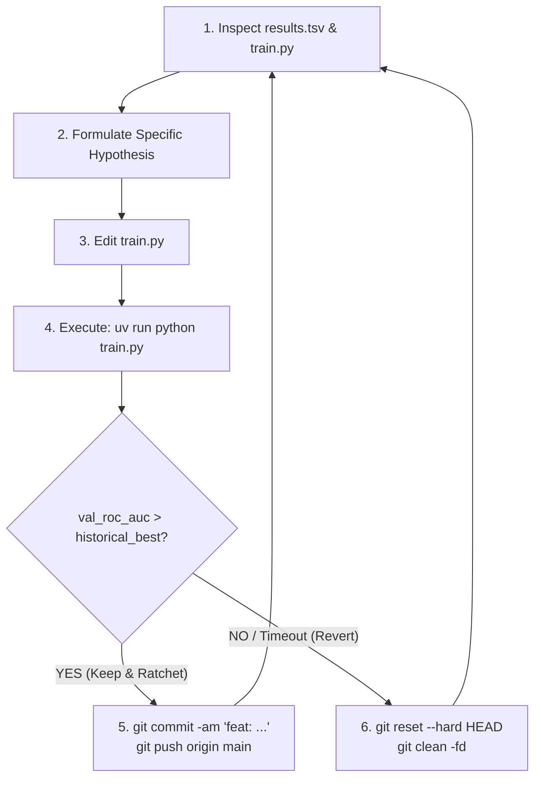

# AutoResearch: Electric Vehicle Adoption Prediction

[](https://www.python.org/downloads/)
[](https://github.com/astral-sh/uv)
[](#benchmark-progression)
[](LICENSE)

An autonomous iterative machine learning experiment loop following the methodology of Andrej Karpathy's [`autoresearch`](https://github.com/karpathy/autoresearch), engineered for tabular classification optimizing **ROC AUC** on electric vehicle purchase intent.

Instead of manual trial-and-error modeling, the system operates in a continuous empirical loop—formulating hypotheses, modifying code, training across deterministic cross-validation folds, evaluating validation ROC AUC, and ratcheting the repository forward via Git commits whenever a new all-time best score is achieved.

---

## Benchmark Highlights

* **All-Time Best OOF ROC AUC**: **`0.943657`** (Fold 0: `0.943945`)
* **Current Champion Architecture**: Asymmetric Rank Blend of Ultra-High-Resolution XGBoost (`max_bin=4096`, `depth=5`, custom domain interaction features `net_green_subsidy` & `sub_x_inc`, `w=0.62`) and LightGBM (`num_leaves=36`, `max_bin=1024`, `w=0.38`).
* **Evaluation Standard**: Deterministic Stratified 5-Fold Cross-Validation (`seed=101`) evaluated on 668,665 training samples with absolute isolation of the test dataset.

---

## Clean Architecture

The repository is organized following a minimalist, high-signal layout:

```text
autoResearch_eVehicles/
├── README.md                      # Public showcase, architecture, and quickstart
├── pyproject.toml                 # uv dependency specifications
├── uv.lock                        # Deterministic dependency lockfile
├── results.tsv                    # Public experiment ledger & benchmark history
├── program.md                     # Research directive & constraints for autonomous agents
│
├── prepare.py                     # [Core Engine] Immutable data loader, split generator & ROC AUC evaluator
├── train.py                       # [Core Sandbox] Champion model & autonomous iteration loop
├── dashboard.py                   # [Core Monitor] Rich terminal dashboard tracking all runs & win rates
│
├── data/                          # [Datasets & Invariant Splits]
│   ├── README.md                  # Dataset descriptions & schema
│   ├── train.csv                  # Competition training set (668,665 rows)
│   ├── test.csv                   # Competition evaluation set (286,571 rows)
│   ├── splits.npy                 # Invariant stratified 5-fold fold assignments
│   └── EV_Adoption_and_Range_Anxiety_Dataset.csv
│
├── docs/                          # [Research Journals & Breakthroughs]
│   ├── research_1.md              # Phase 1 exploratory iterations & baselines
│   └── research_2.md              # Phase 2 breakthroughs (Iterations 11–14, logloss speedup, asymmetric routing)
│
└── experiments/                   # [Advanced & Exploratory Pipelines]
    ├── level_2_meta/              # 4-model meta-stacking (LGBM, XGBoost, CatBoost, TabPFN-3.5) with Optuna
    └── staging/                   # Boosted convergence bake-offs, comparison tables & OOF predictions
```

### File Roles

| Component | Path | Role |
| :--- | :--- | :--- |
| **Harness** | [`prepare.py`](prepare.py) | **IMMUTABLE**: Invariant cross-validation generator, ground truth `evaluate_predictions()`, strict `test.csv` isolation. |
| **Sandbox** | [`train.py`](train.py) | **AUTONOMOUS AGENT PLAYGROUND**: The only file modified during autonomous ratchet iterations. Strict compute budget. |
| **Dashboard** | [`dashboard.py`](dashboard.py) | **CLI DASHBOARD**: Terminal dashboard visualizing best ROC AUC, run counts, regressions, and win rate. |
| **Ledger** | [`results.tsv`](results.tsv) | **BENCHMARK TRACKER**: Flat TSV logging every attempt (`timestamp`, `commit_hash`, `model_architecture`, `val_roc_auc`, `status`). |
| **Stacking** | [`experiments/level_2_meta/`](experiments/level_2_meta/) | **ADVANCED ENSEMBLE**: 4-model Level-2 Meta-Stacker integrating LightGBM, XGBoost, CatBoost, and TabPFN-3.5. |
| **Staging** | [`experiments/staging/`](experiments/staging/) | **MODEL BAKE-OFF**: Boosted convergence evaluations and candidate submission generation. |

---

## Quick Start

### 1. Environment Setup

This project uses [`uv`](https://github.com/astral-sh/uv) for lightning-fast, reproducible dependency management:

```bash
# Clone the repository
git clone https://github.com/aniketkharad/autoResearch_eVehicles.git
cd autoResearch_eVehicles

# Sync dependencies
uv sync
```

### 2. Verify Harness & Invariant Splits

Generate and verify the deterministic stratified 5-fold cross-validation splits:

```bash
uv run python prepare.py
```

### 3. Run Champion Model Training

Execute the current champion model across all folds (with strict timing and memory downcasting):

```bash
uv run python train.py
```

### 4. Launch Research Dashboard

View historical run statistics, model family comparisons, and current best scores in the terminal:

```bash
uv run python dashboard.py
```

---

## The Autonomous Ratchet Cycle

The autonomous research loop adheres to a strict scientific ratchet:



1. **Screening**: Candidate techniques are screened quickly on Fold 0.
2. **Evaluation**: Only candidates outperforming the Fold 0 benchmark (`> 0.943945`) execute full 5-fold cross-validation.
3. **Ratchet**: If the 5-fold OOF ROC AUC beats `0.943657`, the repo ratchets forward. Otherwise, `git reset --hard` safely discards the attempt.

---

## Advanced Ensemble: Level-2 Meta-Stacking

Beyond single-loop iterations, [`experiments/level_2_meta/`](experiments/level_2_meta/) provides a production-grade 4-model ensembling pipeline:

1. **LightGBM**: Fast leaf-wise histogram tree boosting with Optuna-tuned leaves.
2. **XGBoost**: Ultra-high-resolution (`max_bin=4096`) exact depth-5 boosting with custom domain interactions.
3. **CatBoost**: Symmetric oblivious decision trees for robust regularization.
4. **TabPFN-3.5**: Prior-data fitted foundation network generating zero-leakage Bayesian posterior predictions.
5. **Optimization**: Meta-learner with constrained SLSQP and Nelder-Mead multi-start weight optimization over percentile-ranked out-of-fold predictions.

---

## Documentation & Research Logs

* [Phase 1 Research Journal](docs/research_1.md): Exploration of initial tree baselines, rank averaging, and hyperparameter grids.
* [Phase 2 Research Journal](docs/research_2.md): Breakthroughs leading to `0.943657` ROC AUC (logloss evaluation speedup, asymmetric feature allocation, and high-resolution histogram binning).
* [Research Program Directive](program.md): The full behavioral instructions and constraints governing the autonomous research agent.