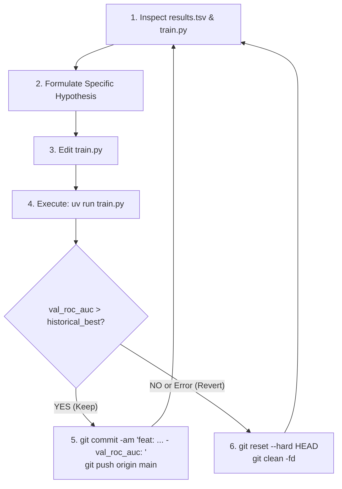

# AutoResearch - Electric Vehicle Purchase Prediction

This repository implements an autonomous iterative ML experiment loop following Andrej Karpathy's [`autoresearch`](https://github.com/karpathy/autoresearch) methodology, adapted for tabular classification optimizing **ROC AUC** on electric vehicle purchase intent.

The human acts as the research director setting goals and constraints in this file. The AI agent acts as the autonomous empirical researcher, modifying `train.py`, executing experiments, evaluating validation ROC AUC, and ratcheting the repository forward commit by commit.

---

## 1. System Architecture & File Roles

The repository is deliberately minimal and relies on flat files and local git:

| File | Status | Role |
| :--- | :--- | :--- |
| `prepare.py` | **LOCKED (IMMUTABLE)** | Dataset loader, deterministic stratified 5-fold CV splits (`splits.npy`), fixed evaluation harness (`evaluate_predictions`). Locks `test.csv` out of reach. |
| `train.py` | **MUTABLE (SANDBOX)** | **The ONLY file modified by the agent.** Contains feature engineering, model architecture, training loop, and experiment logging to `results.tsv`. |
| `program.md` | **HUMAN-LED** | Instructions, constraints, and research directions for the autonomous agent. |
| `dashboard.py` | **READ-ONLY** | Rich terminal dashboard displaying all-time best ROC AUC, win rate, and architecture breakdown. |
| `results.tsv` | **EXPERIMENT LEDGER** | Flat TSV recording every attempt (`timestamp`, `commit_hash`, `model_architecture`, `val_roc_auc`, `status`, `description`). |

---

## 2. Constraints & Rules

1. **Only Edit `train.py`**:
   - You must never modify `prepare.py`, `dashboard.py`, or `splits.npy`.
   - `prepare.evaluate_predictions(y_true, y_pred_proba)` is the ground truth evaluation harness. Do not game, bypass, or alter it.
2. **Strict 60-Second Wall-Clock Budget**:
   - Every experiment run (`uv run train.py`) must complete 5-fold cross-validation and evaluation in **under 60 seconds**.
   - If an experiment exceeds 60 seconds, it is treated as a failure and reverted.
3. **Absolute Isolation of `test.csv`**:
   - `test.csv` is locked out of reach. Never load, probe, or evaluate `test.csv` during research loops.
4. **No Heavyweight MLOps**:
   - Do not install WandB, MLflow, Docker, or external servers. Keep dependencies limited to `uv` and standard tabular packages (`pandas`, `numpy`, `scikit-learn`, `lightgbm`, `xgboost`, `rich`).
5. **The Simplicity Criterion**:
   - All else being equal, simpler code is superior.
   - An improvement of +0.0002 ROC AUC that adds 100 lines of brittle code is not worth keeping.
   - A change that maintains or improves the score while deleting code or simplifying the pipeline is a major win.

---

## 3. The Autonomous Ratchet Cycle

Execute the following loop iteratively without stopping:



### Step-by-Step Instructions:

1. **Inspect Context**:
   - View recent results: `uv run python dashboard.py` or inspect `results.tsv`.
   - Note the all-time historical best ROC AUC score.
   - Read the current state of `train.py`.
2. **Formulate a Specific Hypothesis**:
   - Choose one clear idea: a feature engineering transformation, a hyperparameter shift, a categorical encoding technique, or an alternative model architecture.
   - Update `MODEL_ARCHITECTURE` and `EXPERIMENT_DESCRIPTION` in `train.py`.
3. **Implement in `train.py`**:
   - Apply the modification cleanly in `train.py`.
4. **Execute Training**:
   - Run: `uv run python train.py`.
   - Monitor the output. The script prints:
     `ROC_AUC: <score>`
5. **The Ratchet Decision**:
   - **Case A: Improvement (`val_roc_auc > historical_best`)**:
     - The experiment improved the score. Ratchet forward:
       ```bash
       git commit -am "feat: <model/technique> - val_roc_auc: <score>"
       git push origin main
       ```
   - **Case B: Regression or Execution Error (`val_roc_auc <= historical_best` or crash)**:
     - Discard the changes immediately:
       ```bash
       git reset --hard HEAD
       git clean -fd
       ```
     - *(Note: Your failure has already been safely recorded in `results.tsv` and `.results_history.tsv`).*
6. **Repeat**:
   - Immediately proceed to the next hypothesis.

---

## 4. Research Playbook & Ideas for Tabular Classification

The target is `Will_Buy_EV` (binary: 0 or 1, ~17.5% positive rate across 668,665 samples).
Metric: **ROC AUC** (Area Under the ROC Curve).

### A. Domain Feature Engineering
- **Total Charging Accessibility**:
  `Charging_Stations_Total = Charging_Stations_Near_Home + Charging_Stations_Near_Work`
  `Home_Work_Ratio = Charging_Stations_Near_Home / (Charging_Stations_Near_Work + 1)`
- **Commute vs. Charging Density**:
  `Commute_Per_Station = Daily_Commute_km / (Charging_Stations_Total + 1)`
- **Financial & Capability Ratios**:
  `Income_Per_Car = Annual_Income_USD / (Number_of_Cars_Owned + 1)`
  `Commute_Cost_Proxy = Daily_Commute_km * Annual_Income_USD`
- **Range Anxiety & Home Charging Interactions**:
  `Range_Anxiety_Score`: ordinal map `{'Low': 1, 'Medium': 2, 'High': 3}`
  `Home_Charge_Binary`: `{'No': 0, 'Yes': 1}`
  `Anxiety_x_HomeCharge = Range_Anxiety_Score * (1 - Home_Charge_Binary)`
- **Environmental & Demographic Interactions**:
  `Green_Score = Environmental_Concern_Level * Subsidy_Available_Binary`
  `Age_Binned`: discretizing age into life stages (`<30`, `30-50`, `50-65`, `65+`).

### B. Categorical Encoding Strategies
- Out-of-fold Target Encoding with smoothing.
- Frequency / Count Encoding for high-cardinality categories.
- One-hot encoding for low-cardinality nominal categories (`Gender`, `City_Type`, `Current_Car_Type`).
- Ordered ordinal encoding for `Range_Anxiety_Level`.

### C. Model Architectures & Fast Algorithms
- **LightGBM**:
  - `boosting_type`: `gbdt`, `goss` (faster on large data), `dart`.
  - Hyperparameter tuning: `num_leaves` (15, 31, 63, 127), `learning_rate` (0.03 to 0.15), `min_child_samples` (20 to 100), `subsample` and `colsample_bytree`.
  - Regularization: `reg_alpha` (L1) and `reg_lambda` (L2).
- **XGBoost**:
  - `tree_method="hist"` (essential to stay within the 60s budget on 668k rows).
  - `max_depth` (4 to 8), `subsample`, `colsample_bytree`, `learning_rate`.
- **Ensemble Blending**:
  - Weighted average or rank average of LightGBM + XGBoost out-of-fold prediction probabilities, provided the combined training completes within 60 seconds.

---

## 5. Output Contract

At the end of every run, `train.py` MUST print:
```
---
model:            <model_architecture>
val_roc_auc:      <score>
historical_best:  <score>
status:           keep / regression
total_seconds:    <time>s / 60s
---
ROC_AUC: <score>
```
And append a row to `results.tsv`:
```
<timestamp>\t<commit_hash>\t<model_architecture>\t<val_roc_auc>\t<status>\t<description>
```
